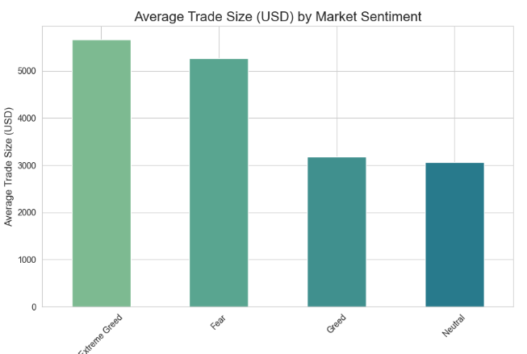
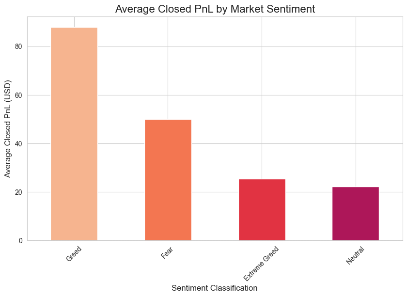
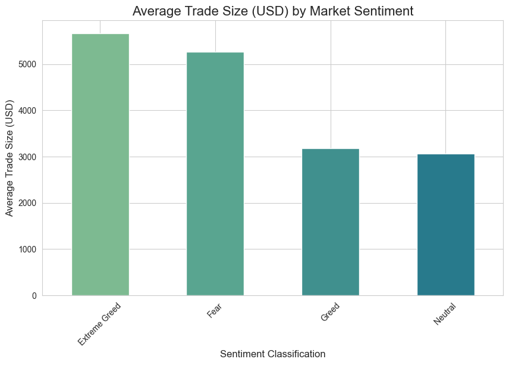

# Analysis of Trader Behavior vs. Market Sentiment

## Project Overview

This project explores the relationship between cryptocurrency trader performance and overall market sentiment. Using historical trade data from Hyperliquid and the daily Bitcoin Fear & Greed Index, this analysis aims to uncover behavioral patterns and deliver insights that could inform smarter trading strategies. The central question is: **Do traders perform better during periods of market fear or greed?**

---

## Key Findings

The analysis revealed a clear and compelling story about trader behavior.

### Finding 1: Most Trading Occurs During Greed & Neutral Periods
The highest volume of trades occurs when market sentiment is classified as 'Greed' or 'Neutral'. Trading activity is significantly lower during periods of 'Fear' and 'Extreme Fear', suggesting that traders are most active when the market is optimistic or stable.



### Finding 2: Periods of Fear Correlate with Significant Losses
Despite lower trading volume, periods of 'Fear' and 'Extreme Fear' are associated with the largest average financial losses for traders. This indicates that while traders are less active, the trades made during these times are particularly unprofitable.



### Finding 3: Traders Take Larger Risks During Extreme Fear
A key behavioral insight is that traders, on average, use significantly larger trade sizes during 'Extreme Fear'. This suggests that traders are engaging in high-risk behavior, such as "catching a falling knife," by making their largest bets when the market is at its most pessimistic.



---

## Conclusion & Potential Strategy

The data paints a picture of classic speculative trading behavior: a high frequency of smaller trades during market optimism, contrasted with larger, high-stakes (and often losing) trades during market panic. The combination of larger trade sizes and larger average losses during fearful periods is a strong indicator of high-risk, low-reward behavior.

**Potential Strategy Implication:** The data suggests that traders should be extremely cautious with position sizing during periods of high fear. A disciplined strategy might involve *reducing* trade size when the Fear & Greed Index signals 'Fear' or 'Extreme Fear' to mitigate the risk of incurring the largest losses.

---

## Tech Stack

* **Python**
* **Pandas:** For data manipulation and analysis.
* **Matplotlib & Seaborn:** For data visualization.
* **Jupyter Notebook:** As the development environment.

---

## How to Run

1.  Clone the repository:
    ```bash
    git clone [https://github.com/YOUR_USERNAME/trader-sentiment-analysis.git](https://github.com/YOUR_USERNAME/trader-sentiment-analysis.git)
    ```
2.  Navigate to the project directory:
    ```bash
    cd trader-sentiment-analysis
    ```
3.  Create and activate a virtual environment:
    ```bash
    python -m venv .venv
    source .venv/bin/activate  # On Windows, use `.\.venv\Scripts\activate`
    ```
4.  Install the required dependencies:
    ```bash
    pip install -r requirements.txt
    ```
5.  Open the analysis notebook in the `notebooks/` directory:
    ```bash
    jupyter lab notebooks/analysis.ipynb
    ```
